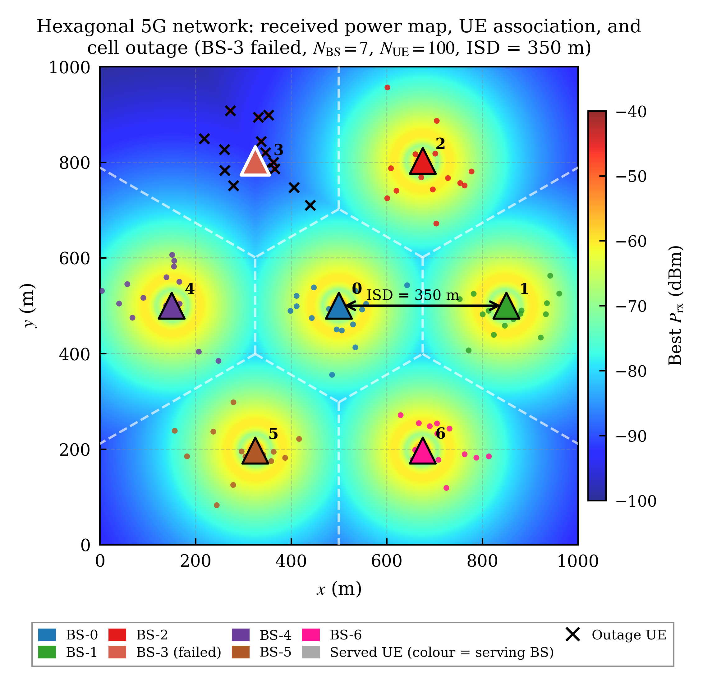
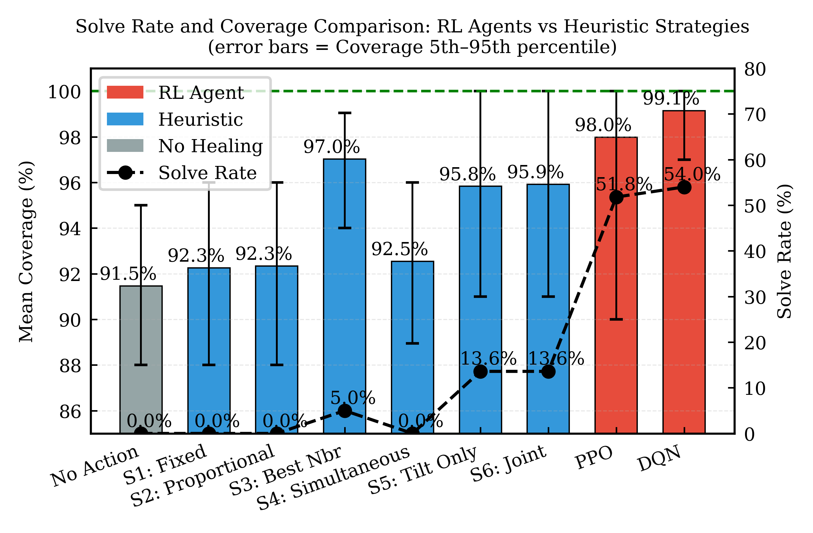
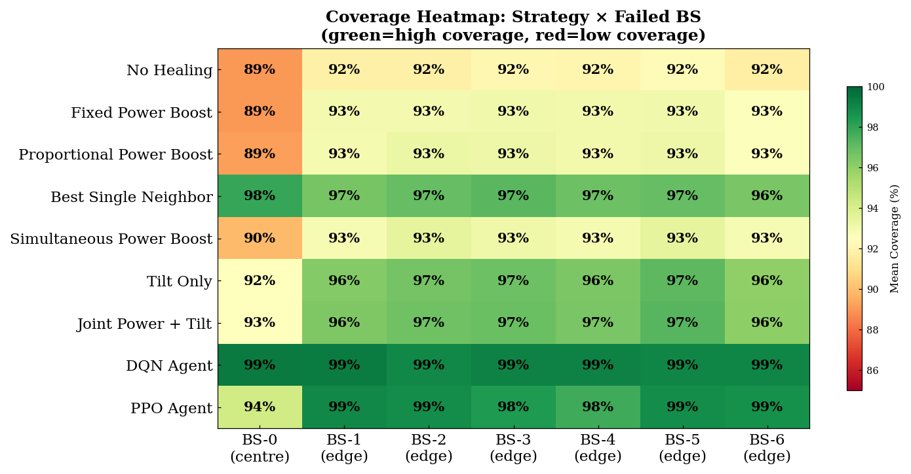
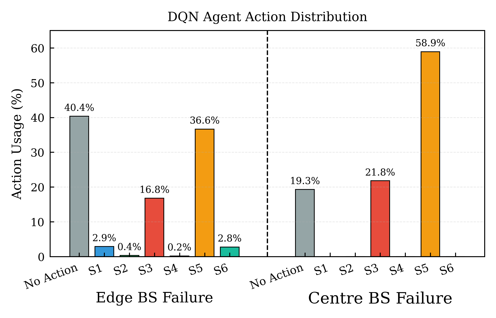

<div align="center">

# Self-Healing RAN
### Deep Reinforcement Learning for 5G Radio Access Network Self-Healing

[](https://www.python.org)
[](https://pytorch.org)
[](https://stable-baselines3.readthedocs.io)
[](https://gymnasium.farama.org)
[](LICENSE)
[](docs/paper_preprint.pdf)
[](https://colab.research.google.com/github/YOUR_USERNAME/self-healing-ran/blob/main/notebooks/03_rl_training.ipynb)

<br>

**Joint Outage Detection and Compensation for Self-Healing 5G RAN via Deep Reinforcement Learning**

*Submitted to IEEE Wireless Communications Letters, 2026*

<br>



</div>

---

## What This Project Does

When a base station (BS) fails in a 5G network, user equipment (UEs) in its
coverage area lose connectivity. This project builds an **autonomous self-healing
system** that:

1. **Detects** the outage in real-time using observable network KPIs
2. **Classifies** each BS as Normal, Outage (root cause), or Degraded (collateral victim)
3. **Compensates** by learning an optimal joint power + antenna tilt policy
4. **Outperforms** all hand-crafted heuristic strategies by a significant margin

### Key Results at a Glance

| Method | Coverage | Solve Rate | Avg Steps |
|--------|----------|------------|-----------|
| No Healing | 91.5% | 0.0% | — |
| Best Heuristic (S3) | 97.0% | 5.0% | 8.5 |
| PPO Agent | 98.0% | 51.8% | 5.9 |
| **DQN Agent (ours)** | **99.1%** | **54.0%** | **5.1** |

> The DQN agent achieves **54% full coverage restoration** vs **5% for the best
> heuristic** — an **11× improvement in solve rate** — while using **less
> power boost** than naive strategies.

---

## System Architecture

```
┌─────────────────────────────────────────────────────────┐
│                   5G Radio Network                      │
│   7 Base Stations • 100 UEs • Hexagonal Topology        │
│   Log-distance Path Loss • 3GPP Antenna Model           │
└──────────────────────┬──────────────────────────────────┘
                       │ KPI streams (E2 interface)
                       ▼
┌─────────────────────────────────────────────────────────┐
│              Cell Outage Detection (COD)                │
│                                                         │
│  Features: UE count, PRB load, delta UE,                │
│            neighbour KPIs (E2-observable only)          │
│                                                         │
│  ┌──────────────┐  ┌──────────────┐  ┌──────────────┐   │
│  │  Threshold   │  │   Logistic   │  │    Random    │   │
│  │     Rule     │  │  Regression  │  │    Forest    │   │
│  │ F1=1.0/0.1   │  │ F1=1.0/0.65  │  │ F1=1.0/0.65  │   │
│  │(Out/Deg)     │  │ (Out/Deg)    │  │ (Out/Deg)    │   │
│  └──────────────┘  └──────────────┘  └──────────────┘   │
│                                                         │
│  3-Class Output: Normal (0) / Outage (1) / Degraded (2) │
└──────────────────────┬──────────────────────────────────┘
                       │ which BS failed + confidence
                       ▼
┌─────────────────────────────────────────────────────────┐
│           Cell Outage Compensation (COC)                │
│                                                         │
│  State (52D): Per-BS KPIs + COD output + global stats   │
│                                                         │
│  Actions (7):                                           │
│    0: Do Nothing                                        │
│    1: Fixed Power Boost (all neighbours)                │
│    2: Proportional Power Boost                          │
│    3: Best Single Neighbour Boost ← best heuristic      │
│    4: Simultaneous Frozen-Snapshot Boost                │
│    5: Tilt Reduction Only ← key for centre BS           │
│    6: Joint Power + Tilt ← most sophisticated           │
│                                                         │
│  ┌─────────────────────┐  ┌─────────────────────────┐   │
│  │    DQN Agent        │  │      PPO Agent          │   │
│  │  [256→256→128→7]    │  │   [256→256→128→7]       │   │
│  │  Cov: 99.1%         │  │   Cov: 98%              │   │
│  │  Solve: 54.0%       │  │   Solve: 51.8%          │   │
│  └─────────────────────┘  └─────────────────────────┘   │
└─────────────────────────────────────────────────────────┘
```

---

## Quick Start

### Option 1 — Google Colab (Recommended, zero setup)

| Notebook | Description | Open |
|----------|-------------|------|
| 01 — Network Simulation | Radio network environment, BS outage, 6 compensation strategies | [](https://colab.research.google.com/github/sajjadhussa1n/self-healing-ran/notebooks/01_network_simulation.ipynb) |
| 02 — COD Pipeline | KPI dataset generation, 3-class classifier training | [](https://colab.research.google.com/github/sajjadhussa1n/self-healing-ran/notebooks/02_cod_pipeline.ipynb) |
| 03 — RL Training | DQN/PPO training, evaluation vs heuristics | [](https://colab.research.google.com/github/sajjadhussa1n/self-healing-ran/notebooks/03_rl_training.ipynb) |

### Option 2 — Local Installation

```bash
# Clone the repository
git clone https://github.com/sajjadhussa1n/self-healing-ran.git
cd self-healing-ran

# Create virtual environment
python -m venv venv
source venv/bin/activate  # Linux/Mac
# venv\Scripts\activate   # Windows

# Install dependencies
pip install -r requirements.txt

# Run the script
python3 main.py
```

---

## Detailed Results

### Coverage Comparison



### Training Curves (DQN vs PPO)


> DQN reaches **99%+ coverage within 1,800 episodes** and maintains it stably.
> PPO converges faster initially but plateaus lower.

### Per-BS Performance Heatmap



> DQN achieves consistent **99%+ coverage across all 7 BS failure scenarios**,
> including the geometrically challenging centre BS (BS-0) where power-only
> heuristics struggle due to the symmetric interference trap.

### Agent Action Preferences



> The DQN agent autonomously discovers that:
> - **S3 (Best Neighbour)** is optimal for edge BS outage
> - **S5 (Tilt Reduction)** is optimal for centre BS outage
>
> This geometry-aware behaviour emerges from reward-driven learning
> without any explicit encoding of the network topology.

### COD Performance

| Classifier | Normal F1 | Outage F1 | Degraded F1 | Accuracy |
|------------|-----------|-----------|-------------|----------|
| Threshold Rule | 0.960 | 1.000 | 0.106 | 0.928 |
| Logistic Regression | 0.954 | 1.000 | 0.649 | 0.924 |
| **Random Forest** | **0.955** | **1.000** | **0.651** | **0.924** |

---

## Novel Contributions

This project makes the following contributions:

**An integrated three-class COD with DRL-COC pipeline:**
A classifier distinguishing root-cause outage from collat
erally degraded neighbours feeds directly into the DRL
agent’s observation state.

**Joint Power + Tilt Action Space:**
A joint power-and-tilt action space, with the agent shown
to learn a geometry-aware policy achieving superior coverage, full network restoration, and compensation energy efficiency than heuristic baselines.

---

## Technical Details

### Network Environment

```
Topology     : 7-BS hexagonal (1 centre + 6 vertices)
ISD          : 350m
UEs          : 100, Gaussian clustered (σ=60m)
Path loss    : Log-distance (n=3.5, f=2.1 GHz)
Antenna      : 3GPP TR 36.942 vertical pattern
Tilt range   : 6° – 25° (nominal 15°)
TX power     : 43 dBm
Noise        : -104 dBm
```

### COD Feature Design

```
Own-cell (5) : ue_count, prb_load, ue_ratio,
               delta_ue_count, delta_prb_load
Neighbours   : ue_count, delta_ue, mean_sinr,
(12 total)     prb_load × 3 nearest BSs

   Deliberately excluded:
    mean_sinr (own cell) — collapses to 0 on outage
    outage_ues flag      — circular reasoning
    tx_power             — directly reveals failure
```

### RL Configuration

```
Algorithm    : DQN (primary), PPO (comparison)
State space  : 52-dimensional normalised vector
Action space : 7 discrete compensation strategies
Network      : MLP [256 → 256 → 128 → 7]
Training     : 50,000 timesteps (~84 minutes, CPU)
Curriculum   : Edge BSs first 2,500 episodes
Discount     : γ = 0.95
```

### Reward Function

```
r = +2.0 × n_rescued_UEs      (primary signal)
  - 1.5 × n_collateral_UEs    (safety constraint)
  + 5.0 × Δcoverage           (continuity)
  + 1.0 × above_baseline      (maintenance)
  + 10.0 (success bonus)
  -  5.0 (timeout penalty)
```

---

## Project Structure

```
self-healing-ran/
├── README.md
├── requirements.txt
├── notebooks/
│   ├── 01_network_simulation.ipynb   # Environment + strategies
│   ├── 02_cod_pipeline.ipynb         # COD dataset + classifiers
│   └── 03_rl_training.ipynb          # DQN/PPO training + eval
├── src/
│   ├── utils/                        # SimConfig
│   ├── network/                      # BS, UE, RadioNetwork
│   ├── detection/                    # KPILogger, COD classifiers
│   ├── compensation/                 # 6 heuristic strategies
│   ├── environment/                  # Gymnasium wrapper
│   └── agents/                       # DQN/PPO training
├── models/                           # Pre-trained model weights
├── results/                          # Evaluation CSVs and plots
└── docs/                             # Paper, figures
```

---

## Citation

If you use this work in your research, please cite:

```bibtex
@article{HussainS2026selfhealing,
  title   = {Joint Outage Detection and Compensation for Self-Healing 5G RAN via Deep Reinforcement Learning},
  author  = {Sajjad Hussain},
  journal = {IEEE Wireless Communications Letters},
  year    = {2026},
  note    = {Submitted}
}
```

---

## Requirements

```
python>=3.10
numpy>=1.24
matplotlib>=3.7
scipy>=1.10
pandas>=2.0
gymnasium>=0.29
stable-baselines3>=2.0
scikit-learn>=1.3
torch>=2.0
```

---

## 📬 Contact

**Dr. Sajjad Hussain**
- 📧 sajjad.hussain2@seecs.edu.pk
- 💼 [LinkedIn](https://www.linkedin.com/in/sajjad-hussain-07977748/)
- 🔬 [Google Scholar](https://scholar.google.com/citations?user=WPmIWr0AAAAJ)

**Affiliation:** School of Electrical Engineering and Computer Science (SEECS), National University of Sciences and Technology (NUST), Pakistan

*This project is part of ongoing research in autonomous 5G network
management and intelligent RAN design.*

---

## License

This project is licensed under the Creative Commons Attribution–NonCommercial 4.0 International License (CC BY-NC 4.0)
See [LICENSE](LICENSE) for details.

---

<div align="center">

**⭐ If this project helped your research, please consider starring the repo ⭐**

*Built with Python • Stable-Baselines3 • Gymnasium • scikit-learn*

</div>
